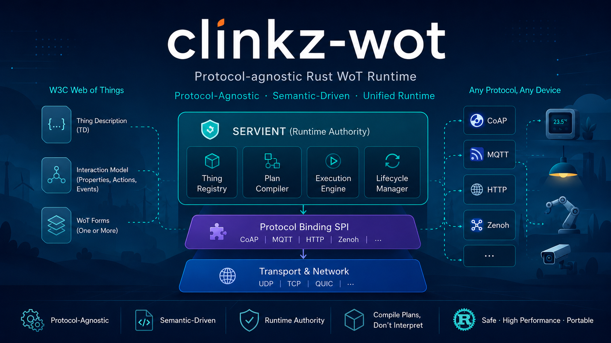

<div align="center">



# 从零设计一个 Rust WoT Runtime

**ClinkZ-WoT 的架构、实现与 AI 协作开发实录**

[ClinkZ-WoT 主项目](https://github.com/yushun1990/clinkz-wot) ·
[文章计划](./CONTENT_PLAN.md) ·
[写作规范](./EDITORIAL_GUIDE.md) ·
[AI 协作规则](./AGENTS.md)

</div>

---

## 关于本仓库

`clinkz-wot-notes` 保存围绕 [ClinkZ-WoT](https://github.com/yushun1990/clinkz-wot)
形成的技术文章、架构解释和开发复盘。

本仓库有两个目标：

1. 向更多开发者介绍 ClinkZ-WoT、W3C Web of Things 和协议中立运行时；
2. 通过持续写作，迫使作者重新解释、质疑和验证项目设计，真正掌握
   ClinkZ-WoT 的开发能力，而不是只接受 AI 生成的结论。

文章会覆盖：

- W3C WoT 与 Thing Description；
- Servient 运行时架构；
- Protocol Binding SPI；
- Logical Plan、Binding Artifact 与编译计划；
- 生命周期、generation、取消和资源治理；
- Rust、异步运行时与 `no_std + alloc`；
- 人与 AI 如何长期推进复杂 Rust 项目。

## 与主项目的关系

两个仓库承担不同职责：

| 仓库 | 责任 |
|---|---|
| [`clinkz-wot`](https://github.com/yushun1990/clinkz-wot) | 源码、测试、正式架构、ADR、规范、计划和项目状态 |
| `clinkz-wot-notes` | 面向读者的解释、文章源稿、写作计划、图解和开发复盘 |

本仓库不是 ClinkZ-WoT 的规范来源。发生冲突时，应以主项目中的源码、
测试和正式架构文档为准。

文章必须明确区分：

- 已经由源码和测试证明的行为；
- 已接受但尚未实现的架构设计；
- 已进入计划但尚未冻结的方向；
- 仍在讨论的方案；
- 已废弃或仅用于历史说明的设计。

详细规则见 [SOURCE_POLICY.md](./SOURCE_POLICY.md)。

## 推荐阅读路线

### 第一部分：理解 WoT

1. 为什么物联网平台不应该从 MQTT Topic 开始设计
2. W3C WoT 不是一种新协议
3. Thing Description 是语义契约，而不是设备配置文件
4. 一个 Thing 有多个 Form 时，运行时如何选择

### 第二部分：理解 ClinkZ-WoT

1. 从 TD 到一次属性读取
2. 为什么 WoT Runtime 需要预编译执行计划
3. Logical Plan 与 Binding Artifact
4. Servient 为什么必须成为运行时权威
5. Protocol Binding 为什么不能直接调用 Handler

### 第三部分：理解 Rust 运行时约束

1. 异步取消不等于 Drop Future
2. 为什么外部回调必须在锁外执行
3. Subscription 为什么不应该 Clone
4. 为什么所有队列、缓存和后台工作都必须有上限

### 第四部分：理解 AI 工程协作

1. 聊天记录不是项目记忆
2. AGENTS、PLAN 和 PROJECT_STATE 各自负责什么
3. 如何避免 AI 在大型项目中反复重做架构
4. 如何把复杂重构拆成可验证的 Work Package DAG

完整选题和顺序见 [CONTENT_PLAN.md](./CONTENT_PLAN.md)。

## 仓库结构

```text
.
├── README.md
├── AGENTS.md
├── PROJECT_STATE.md
├── CONTENT_PLAN.md
├── EDITORIAL_GUIDE.md
├── SOURCE_POLICY.md
├── AI_WORKFLOW.md
├── CONTRIBUTING.md
├── articles/
│   ├── 01-wot-foundations/
│   ├── 02-runtime-architecture/
│   ├── 03-rust-runtime/
│   └── 04-ai-engineering/
├── drafts/
├── templates/
│   └── article-template.md
└── assets/
    ├── covers/
    ├── diagrams/
    └── images/
```

## 文章状态

文章使用以下状态：

| 状态 | 含义 |
|---|---|
| `IDEA` | 已登记选题 |
| `OUTLINED` | 已形成可审查提纲 |
| `DRAFTING` | 正在写作 |
| `REVIEWING` | 正在做技术和事实校验 |
| `PUBLISHED` | 已发布 |
| `REVISING` | 因项目演进正在修订 |
| `ARCHIVED` | 仅保留历史价值，不再代表当前设计 |

## 写作原则

每篇文章至少回答六个问题：

1. 现实中遇到了什么问题？
2. 最直觉的方案是什么？
3. 这个方案在哪些情况下会失败？
4. 有哪些主要替代方案？
5. ClinkZ-WoT 当前选择了什么边界，为什么？
6. 该选择如何落实到 Rust 类型、模块、生命周期或数据流？

文章不以堆砌术语为目标。真正有价值的是呈现设计冲突、失败路径、取舍和
验证过程。

## 发布渠道

- GitHub：保存文章源稿、图片、项目基线和修订历史；
- 知乎：面向中文读者发布和讨论；
- 其他平台：后续可从同一份 Markdown 源稿同步。

知乎发布后，应将文章链接、发布日期和对应的 ClinkZ-WoT commit 回填到
文章元数据中。
